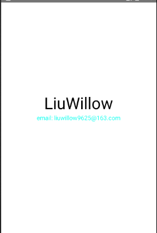
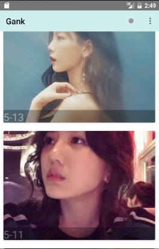
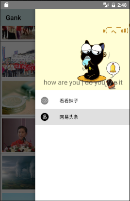

# NewLooklook
一个可以看妹子，浏览网易新闻的app

## Screenshots

## About App
app中使用到的开源库： 
RXJAVA 
RETROFIT2 
GSON 
HTMLTEXTVIEW 
BUTTERKNIFE 
MATERRIA DESIGN 
VARDVIEW 
GLIDE 
DRAGPHOTOVIEW 

## About Me
一个不务正业自学JAVA一年多的大四工科生- - 正在朝着后台架构师的方向前进
邮箱 liuwillow9625@163.com
